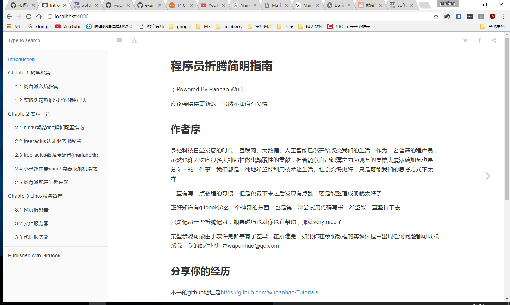

# 程序员折腾简明指南
（Powered By Panhao Wu）

应该会慢慢更新的，虽然不知道有多慢

## 作者序

身处科技日益发展的时代，互联网、大数据、人工智能已然开始改变我们的生活，作为一名普通的程序员，虽然也许无法向很多大神那样做出颠覆性的贡献，但若能以自己绵薄之力为现有的高楼大厦添砖加瓦也是十分荣幸的一件事，我们都是单纯地希望能利用技术让生活、社会变得更好，只是可能我们的思考方式不太一样

一直有写一点教程的习惯，但是积累下来之后发现有点乱，要是能整理成册就太好了

正好知道有gitbook这么一个神奇的东西，也是第一次尝试用代码写书，希望能一直坚持下去

只是记录一些折腾记录，如果碰巧也对你也有帮助，那就very nice了

某些步骤可能由于软件更新等有了差异，在所难免，如果你在参照教程的实验过程中出现任何问题都可以联系我，我的邮件地址是wupanhao@qq.com

## 分享你的经历

本书的github地址是[https://github.com/wupanhao/Tutorials](https://github.com/wupanhao/Tutorials)

若你感兴趣，也可以pull下来添加一些内容，我会非常乐意，gitbook写作挺方便的

### gitbook简易教程

确保电脑上安装好了nodejs及npm

命令行安装gitbook
`npm install -g gitbook-cli`

根据SUMMARY.md生成对应的章节文件
`gitbook init`

编辑对应章节的md文件(推荐sublime_text编辑器或是vim)，可能你需要一点Markdown
的基础知识[http://www.jianshu.com/p/q81RER](http://www.jianshu.com/p/q81RER)

编写好之后就可以编译并启动预览服务器
`gitbook serve`

编译成功后会监听本地4000目录

浏览器打开 [http://localhost:4000](http://localhost:4000)查看效果
