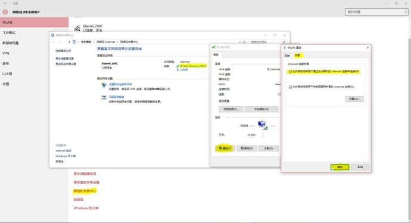

# 1.2 获取树莓派ip地址的N种方法

博主也曾经要靠显示器要靠路由器才能获取到树莓派的ip地址，随着知识技能的增长，也发现了不少其它的方法，特此总结一下常用的几种，大家可以根据情况选择最方便的方法

## 有显示器​

​打有显示器还说个毛线，直接图形界面打下开终端运行ifconfig命令就可以了

## 无显示器有路由器​

也是比较方便的情况，电脑或手机连接路由器的网络（网线或wifi），树莓派通过网线连接路由器，电脑或手机登录路由器管理界面（浏览器输入路由器ip，根据路由器差异有所不同，我的小米路由器是192.168.31.1，注意是普通的路由器不能改成交换机），查看已连接设备的ip分配情况，不出意外能看到一个名叫raspberry的设备，就是它了

## 只有电脑（windows,电脑有网线接口。。。Mac 等有机会用的时候测试一下再加上）

### 网线直连

网线直接把树莓派与电脑连接起来，电脑需要连wifi（如果不连接无法使用网络共享让树莓派获取到ip地址），在 设置->网络->wlan->网络与共享中心->wlan->属性->共享->允许​其它用户通过它来连接->确定


稍等片刻树莓派应该就获取到一个ip地址了，此时打开命令提示符（我用的Xshell），运行`arp -a`命令，应该就可以看到​一个局域网段，如`192.168.xx.1`，通常以192.168开头，最后一位是1的那个接口，下面多出来的一条动态记录就是树莓派的

### 串口登录（需要先开启树莓派的串口）

教程待续

## 只有手机（目前只测试了安卓，iphone应该类似）

//转载请注明出处，发个教程折腾了一晚上，求心理阴影面积。。。​

由来：​​把树莓派直接接学校的网线来搭建文件服务器和网站服务器，可是偶尔学校核心机房断电导致ip变动，每次都要接显示器查看ip或用nmap等工具扫描，比较麻烦，灵光忽闪想到手机有usb网络共享功能，于是想试试能不能手机直接登陆树莓派，百度了一下发现有人已经试过并且成功了，但是还要在树莓派上改为静态ip也麻烦，并且常常在此之前我们并不能操作树莓派，于是自己折腾一番，发现了下面这个自认为比较方便的办法，全程树莓派除开机以外无需做任何事，献给所有不方便获取ip的树莓派爱好者
​​

工具：支持usb网络共享和便携式WLAN热点的手机一部 （安装具备局域网扫描功能的软件和能ssh远程登陆的软件）+ 能正常开机的树莓派一台​

### usb共享手机网络
手机通过数据线连接连接树莓派并通过usb共享自己的网络，同时打开便携式WLAN热点（如不开启无法通过局域网扫描树莓派ip地址）

 

 

### 局域网扫描
使用局域网扫描软件扫描一下，很快应该就能看到树莓派的ip地址（我就用的ES文件管理器，因为貌似树莓派默认开启了sftp服务，这一步不必等它扫描完，比较耗时，看见有搜索结果就可以取消扫描了）​

三、根据该ip用手机端的软件ssh​登陆树莓派​（我用的ConnectBot）

 
​PS：可能由于系统版本手机型号等原因有各种各样问题（我不一定会解决所以不用问我了），我用的是红米note2 + raspberry pi 2 （raspbian系统，较新的），手机端开启usb网络共享后很快树莓派就能通过DHCP获取到ip地址了

 
运行`ifconfig`命令发现多了usb0这个网络接口
​hahahaha ， 大工告成 ， 以后可以随时在外面使用树莓派啦~~~一款移动工作站就此诞生~~~

​若有不对之处还请大神各位批判指正，欢迎大家互相交流学习

附个QQ，无事勿扰：877594836​