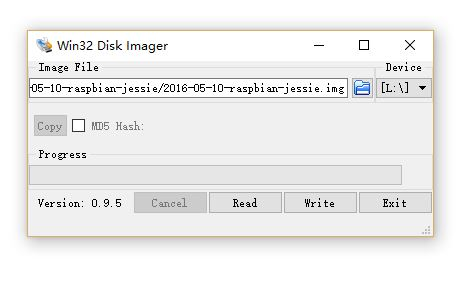

# 1.1 树莓派入坑指南

## 树莓派简介

树莓派由注册于英国的慈善组织“Raspberry Pi 基金会”开发

树莓派(英文名为“Raspberry Pi”）,是为学生计算机编程教育而设计，只有信用卡大小的微型电脑，其系统基于Linux，因此Linux能做的它大部分都能做。 

它是一款基于ARM的微型电脑主板，以MicroSD卡为内存硬盘，板载USB接口和以太网接口和蓝牙wifi等，同时拥有HDMI高清视频输出接口，还有可编程控制的GPIO针脚，能执行一些简单的硬件操作，因此其扩展性极强。以上部件全部整合在一张仅比信用卡稍大的主板上，具备所有PC的基本功能只需接通显示器和键盘，就能执行如电子表文字处玩游播放高清视频等诸多功能。

又因其功耗低（一般只有几瓦，满负荷运行也最多十几瓦）又经常用来做各种小型服务器如web,samba,ftp,shadowsocks,aria2等

## 购买指南

树莓派官方售价为35美元，国内有代理商，国产的淘宝上最便宜200左右就能买到（某东上将近300，略坑），对产地不是很看重的国产的就够了。当然这样的树莓派只是一块空的板子，不含其它任何配件，相当于一台没有硬盘的主机，因此要想它能正常启动，至少还需要：一张8G以上的内存卡（推荐16G class10级别的，价格大约30元），作为它的系统盘一条usb线（10元左右）供电（需要有5V 1A以上的usb充电插头 30元以内，手机的也能用）

这样就能正常启动了，但为了方便还可以选购下列配件一根网线（10元左右 比wifi稳定一点，推荐绿联旗舰店的线材和一些别的数码配件，质量不错）散热片（几元钱）小风扇（20元以内）外壳（几元到20元左右都有）一块带HDMI的小显示屏（非必需品且较贵，最便宜200元以内能买到），资金充裕的同学可以选购一套便携的蓝牙键鼠（50元以内就有）

## 第一次启动

### 烧录系统 启动

树莓派只相当于​一台没有硬盘的主机，系统还需要自己准备，通常用SD卡制作树莓派的启动盘（需要通过读卡器把SD卡连到电脑上）

使用​Win32DiskImager软件烧录系统，注意选对设备和系统镜像img文件，img文件可以去树莓派官网下载，第一次用推荐选择raspbian系统，选好后点击Write，它会提示你这会清除SD卡上原有的所有信息，确定没选错就继续，然后它会慢慢把整个系统烧录进去

等待进度条跳完，弹出SD卡（你会发现显示只有几十兆大了，这是正常的，Linux下的文件系统Windows不支持而已，也可以下载专门的软件查看），插到树莓派的卡槽上，通电，不出意外它就正常启动了

​
### 登录到树莓派

有显示器的可以直接访问树莓派的图形界面，没有也无妨，给它联网也能照常访问

Windows用Xshell或putty，Macbook​​用自带的terminal，手机安卓用ConnectBot，juiceSSH等，iphone用支持ssh远程登陆的软件（搜索一下应该就能找到），注意必须确保你的手机或电脑要和树莓派至少有一个相同的网段

通过 ssh pi@你树莓派的ip地址  登录你的树莓派​（如 `ssh pi@192.168.31.133`）,默认密码raspberry

至此大功告成，之后就可以畅游Linux的世界啦​

当然你还得​知道一些常用的Linux命令，比如:

* 远程登录 ：ssh​  ip地址 或 ssh 用户名@ip地址

远程登陆Linux系统，例如 ssh pi@172.16.122.16 

* 切换目录（change directory）：cd  目录​

这个目录​可以是绝对目录（以/开始的完整路径，目录与目录间用/分隔），也可以是相对目录（相对当前目录的路径，其中点号"."表示当前目录，双小数点".."表示上层目录，比如的切换进当前目录的temp目录可以用cd temp 或 cd ./temp）

* 列出目录下的内容（list）：ls  目录

目录同上，不加目录默认当前目录，加参数al列出详细内容， 如列出当前目录下的详细内容用 ls -al

* 文本编辑器：nano 文件名

文件不存在则新建空文件，如 nano test.txt

* 复制（copy）：cp 源文件 新文件路径

两边都是包含文件名的路径​

* 打印工作目录（print working directory）：pwd

显示当前目录​的绝对路径

* 移动或重命名文件（move）：mv   原文件路径   新文件路径

绝对路径相对路径均可，注意别写错了​

* 浏览文件内容：cat 文件名​

查看当前目录下的test.txt 文件  cat test.txt​

* 回声：echo​ 字符串

就是回声​，输出echo后面的字符串

* 查看网卡信息：ifconfig​

会显示出所有网卡的ip等信息

* 软件管理：apt-get

安装软件：sudo apt-get install 软件名 。如安装tightvncserver ​：sudo apt-get install tightvncserver 
更新软件包：sudo apt-get update​

*  关机：halt ，重启：reboot

需要root权限，树莓派pi用户通常在前面加sudo以root身份执行一次命令​，如重启使用sudo reboot

​暂时先写这么多，有空再加