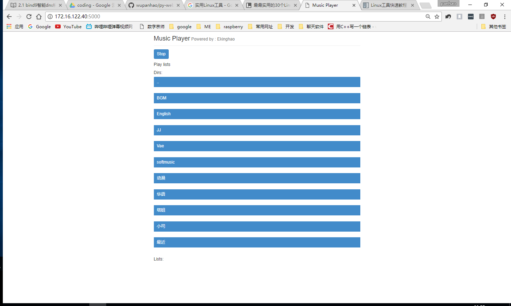

# 1.4 第一个项目 网页控制的音乐播放器

树莓派到手了，我们拿它来做什么呢？可以像我一样，第一个项目做一个网页控制的树莓派音乐播放器

## PHP版

### 环境
+ 正常工作的树莓派一台
+ 支持PHP的web服务器环境（apache + PHP 或是 nginx + php-fpm）
+ 树莓派连接上音响并可通过omxplayer命令行播放歌曲
+ 存放歌曲的目录

此外还要确保www-data对音频设备有读写的权限,root用户下执行
`echo 'SUBSYSTEM=="vchiq",GROUP="video",MODE="0660"' > /etc/udev/rules.d/10-vchiq-permissions.rules`

`usermod -aGvideo www-data`

PHP代码
```
<!DOCTYPE html>
<html>
<head>
   <title>Music Player</title>
   <link href="css/bootstrap.min.css" rel="stylesheet">
   <meta charset="utf-8">
   <meta name="viewport" content="width=device-width, initial-scale=1">
   <meta name="viewport" content="width=device-width, initial-scale=1,
    maximum-scale=1, user-scalable=no">
</head>
<body>
<div class="container">
   <div class="row" >
         <h1>Music Player<small> Powered by : Ekinghao </small></h1>
   <hr>
   <a href="webplayer.php?cmd=killall" class="btn btn-primary btn-lg" role="button">
        Stop   </a>
<?php
if($_GET['cmd']=="killall")
    shell_exec("killall omxplayer.bin");
else if($_GET['musicpath']){
    $music=urldecode($_GET['musicpath']);
    shell_exec("killall omxplayer");
    $cmd="omxplayer -o local \"".$music."\"";
    //shell_exec('mpg123 -a hw:2,0 "'.$music.'"');
    //omxplayer -o local
    //mplayer -ao alsa plughw,hw,2,0 music.mp3
    shell_exec($cmd);
    echo $music.$cmd;
    echo basename($music)." is on playing~<br>";
}
else{
    $defaultpath="/home/pi/kugou";
    if($_GET['dirpath'])
    $defaultpath=urldecode($_GET['dirpath']);
    $dirs=scandir($defaultpath);
            echo "<h3>contents:</h3>";
       echo '<div class="list-group">';

    foreach($dirs as $dir){
        $rawpath="$defaultpath"."/".$dir;
        $codepath=urlencode($rawpath);
        if(is_dir($rawpath))
            echo '<a href="webplayer.php?dirpath='.$codepath.
            '" class="list-group-item active" >'.$dir.'</a><br>';
     }
            echo '</div>';
            echo"<h3>lists:</h3>";

    echo '<div class="list-group">';

    foreach($dirs as $dir){
        $rawpath="$defaultpath"."/".$dir;
        $codepath=urlencode($rawpath);
        if(!is_dir($rawpath)){
            if(substr($rawpath,-3)=='mp3')
                echo '<a href="webplayer.php?musicpath='.$codepath.
                '" class="list-group-item">'.$dir.'</a>';
            }
    }
    echo '</div>';
}
?>
</body>
        </html>
```

## Python版

项目地址[https://github.com/wupanhao/py-web-player](https://github.com/wupanhao/py-web-player)

demo
